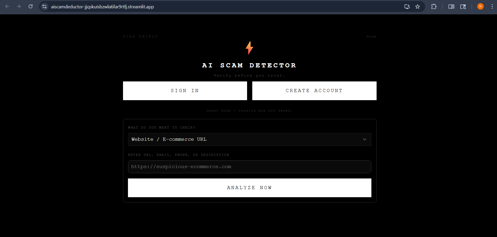
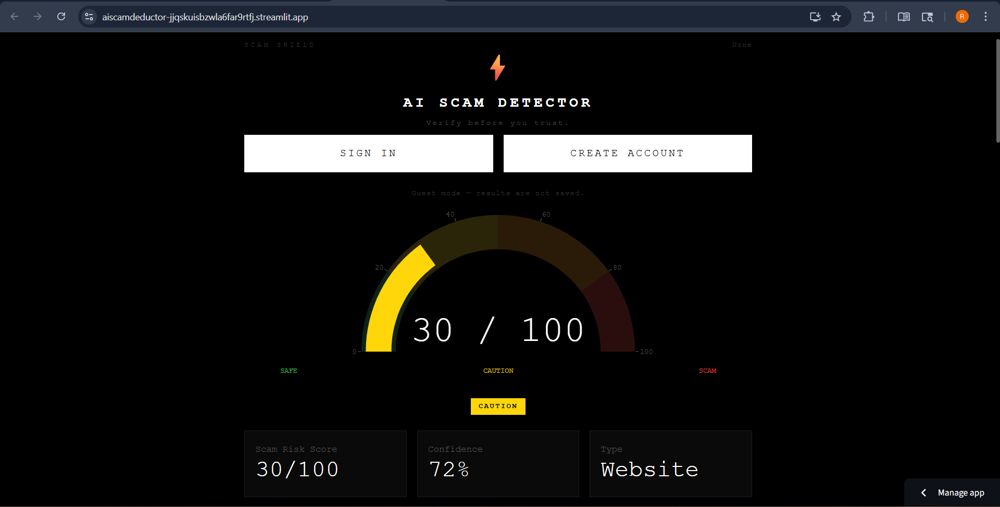

# 🛡️ AI ScamDeductor

[](https://opensource.org/licenses/MIT)
[](https://www.python.org/downloads/)
[](https://fastapi.tiangolo.com/)
[](https://streamlit.io/)

**AI ScamDeductor** is a sophisticated, full-stack scam detection platform designed to protect users from the evolving landscape of digital fraud. By combining heuristic domain analysis, real-time phishing database lookups, and state-of-the-art LLM analysis (via Groq), it provides an exhaustive risk assessment for URLs, messages, and social profiles.

---

## 🖼️ Screenshots

### Home / Input Screen



### Analysis Result Screen



---

## ✨ Key Features

- **🌐 Comprehensive Website Scan:** Analyzes domain age, SSL certificate validity, suspicious TLDs, and brand impersonation signals.
- **🧠 AI-Powered Analysis:** Leverages Llama-3 (via Groq) to provide deep, contextual reasoning for every detected threat.
- **🔍 Multi-Vector Detection:** Tailored scanning for Job Scams, UPI Fraud, Seller Scams, SMS Phishing, and more.
- **🛡️ Database Integration:** Cross-references inputs against PhishTank and Google Safe Browsing.
- **📊 Detailed PDF Reports:** Generates professional, shareable reports summarizing findings and recommendations.
- **⚡ Real-time Search:** Queries SerpAPI to identify existing fraud reports and community warnings online.

---

## 🏗️ Architecture

The project follows a modern, decoupled architecture:

- **Backend:** FastAPI (Python) - Asynchronous API handling, background task processing (ARQ/Redis), and JWT authentication.
- **Frontend:** Streamlit - A clean, responsive dashboard for interacting with the detection engine.
- **Database:** PostgreSQL (with SQLAlchemy/Alembic) - For user management and persistent scan history.
- **Caching:** Redis - To ensure lightning-fast responses for repeated scans.

---

## 🚀 Getting Started

### Prerequisites

- Python 3.12+
- Docker & Docker Compose
- API Keys for: [Groq](https://console.groq.com/), [SerpAPI](https://serpapi.com/), and [Google Safe Browsing](https://developers.google.com/safe-browsing/v4/get-started).

### Quick Start with Docker

1. **Clone the repository:**
   ```bash
   git clone https://github.com/RajkumarBR9789/AI_Scam_deductor.git
   cd AI_Scam_deductor
   ```

2. **Configure Environment:**
   Copy `.env.example` to `backend/.env` and fill in your API keys.

3. **Launch the stack:**
   ```bash
   docker-compose up --build
   ```

4. **Access the application:**
   - Frontend: `http://localhost:8501`
   - API Docs (Swagger): `http://localhost:8000/docs`

---

## 🛠️ Tech Stack

- **Backend:** FastAPI, Pydantic, SQLAlchemy, Alembic, ARQ (Redis Queue).
- **Frontend:** Streamlit, Pandas, Plotly.
- **Security:** JWT (RS256), BCrypt, SlowAPI (Rate Limiting).
- **Infrastructure:** Docker, Redis, PostgreSQL.

---

## 🤝 Contributing

Contributions are welcome! Please feel free to submit a Pull Request.

1. Fork the Project
2. Create your Feature Branch (`git checkout -b feature/AmazingFeature`)
3. Commit your Changes (`git commit -m 'Add some AmazingFeature'`)
4. Push to the Branch (`git push origin feature/AmazingFeature`)
5. Open a Pull Request

---

## 📄 License

Distributed under the **MIT License**. See `LICENSE` for more information.

---

## 📞 Contact

**Project Link:** [https://github.com/RajkumarBR9789/AI_Scam_deductor](https://github.com/RajkumarBR9789/AI_Scam_deductor)

---
*Disclaimer: AI ScamDeductor is an automated tool for informational purposes. Always exercise caution and verify sensitive transactions through official channels.*
